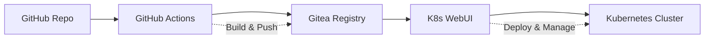

# K8s WebUI

🚀 Modern Kubernetes and GitOps management platform with cyberpunk aesthetics. Think ArgoCD meets Grafana with a Matrix-style terminal interface.

## 🎯 Overview

A comprehensive web-based platform for managing Kubernetes clusters and GitOps workflows. Features a sleek cyberpunk UI with green/yellow/cyan accents on a black terminal-style background.

### Key Capabilities
- **Kubernetes Management**: Pods, deployments, nodes, scaling, logs
- **GitOps Operations**: Repository sync, application deployment, ArgoCD-like workflow  
- **Monitoring & Metrics**: Resource usage, historical trends, Grafana-style dashboards
- **Authentication**: PASETO v4 tokens, role-based access control
- **Single Binary**: Embedded React SPA, SQLite database, zero external dependencies

## 🏗️ Architecture

### Tech Stack
- **Backend**: Go 1.24 + SQLite + PASETO auth
- **Frontend**: React 19 + TypeScript + Tailwind CSS + Vite
- **Deployment**: Single Docker image, Kubernetes-ready
- **Database**: SQLite (embedded, no external services)

### Project Structure
```
k8s-webui/
├── backend/           # Go REST API server
│   ├── cmd/server/    # Main application entry
│   ├── internal/      # Business logic
│   │   ├── api/       # HTTP handlers
│   │   ├── auth/      # Authentication service
│   │   ├── database/  # SQLite operations
│   │   ├── gitops/    # GitOps management
│   │   ├── k8s/       # Kubernetes client
│   │   └── metrics/   # Monitoring service
│   └── pkg/config/    # Configuration
├── frontend/          # React SPA
│   ├── src/
│   │   ├── components/ # UI components
│   │   ├── stores/     # State management
│   │   └── types/      # TypeScript definitions
│   └── dist/          # Build output (embedded in Go)
├── docker-compose.yml # Development setup
├── Dockerfile         # Production image
└── build.sh          # Local build script
```

## 🎨 UI Features

### Cyberpunk Design System
- **Colors**: Matrix green (#00FF00), yellow (#FFFF00), cyan (#00FFFF) on black
- **Typography**: Monospace fonts for terminal aesthetic  
- **Layout**: Responsive grid system with border outlines
- **Components**: Custom charts, tables, modals with cyberpunk styling

### Dashboard Views
- **Cluster Overview**: Real-time resource metrics and health status
- **Pod Management**: List, restart, delete, view logs with filtering
- **Deployment Control**: Scale replicas, view status, manage rollouts
- **GitOps Dashboard**: Repository sync status, application deployments
- **Resource Analytics**: CPU/memory/storage trends with interactive charts

## 🔧 Core Functionalities

### Kubernetes Management
```bash
# Pod Operations
GET    /api/k8s/pods              # List all pods
DELETE /api/k8s/pods/{name}       # Delete specific pod
POST   /api/k8s/pods/{name}/restart # Restart pod
GET    /api/k8s/pods/{name}/logs  # Stream logs

# Deployment Control  
GET   /api/k8s/deployments        # List deployments
PATCH /api/k8s/deployments/{name}/scale # Scale replicas

# Cluster Monitoring
GET /api/k8s/nodes                # List nodes with metrics
GET /api/k8s/health               # Cluster health check
```

### GitOps Workflow
```bash
# Repository Management
POST /api/gitops/repositories     # Connect Git repo
GET  /api/gitops/repositories     # List connected repos
POST /api/gitops/repositories/{id}/sync # Sync repo

# Application Deployment
POST /api/gitops/applications     # Deploy application
GET  /api/gitops/applications     # List deployments
POST /api/gitops/applications/{id}/sync # Sync app
```

### Metrics & Monitoring  
```bash
# Resource Metrics
GET /api/metrics/cluster          # Cluster-wide usage
GET /api/metrics/nodes            # Per-node metrics
GET /api/metrics/pods             # Pod resource usage
GET /api/metrics/history          # Historical trends
```

## 🚀 Use Cases

### 1. **GitOps CI/CD Pipeline**
Perfect for teams using GitHub Actions → Gitea Registry → Kubernetes:



**Workflow:**
1. Developer pushes code to GitHub
2. GitHub Actions builds Docker image
3. Image pushed to Gitea private registry
4. K8s WebUI detects changes, deploys to cluster
5. Monitor deployment status and metrics

### 2. **Multi-Environment Management**
Manage dev/staging/prod environments from single interface:

- **Environment Isolation**: Separate namespaces and configs
- **Progressive Deployment**: Deploy to dev → staging → prod
- **Resource Monitoring**: Track usage across environments
- **Access Control**: Role-based permissions per environment

### 3. **Kubernetes Cluster Administration**
Daily cluster operations and troubleshooting:

- **Resource Management**: Scale deployments based on metrics
- **Troubleshooting**: View logs, restart failed pods
- **Capacity Planning**: Monitor node resources and usage trends
- **Security**: Audit logs and access control

### 4. **Development Team Self-Service**
Empower developers with safe cluster access:

- **Deployment Control**: Deploy and rollback applications
- **Log Access**: Debug issues without kubectl access
- **Resource Monitoring**: Track application performance
- **Environment Management**: Manage feature branch deployments

### 5. **GitOps Repository Management**
Centralized management of infrastructure as code:

- **Repository Sync**: Auto-sync K8s manifests from Git
- **Application Lifecycle**: Deploy, update, delete applications
- **Configuration Management**: Manage ConfigMaps and Secrets
- **Compliance**: Track changes and maintain audit trail

## 🔐 Authentication & Authorization

### User Roles
- **Admin**: Full cluster access (create, read, update, delete)
- **Operator**: Deploy and manage applications (read, update, scale, sync)  
- **Viewer**: Read-only access to resources and metrics

### Default Credentials (Demo)
```bash
Username: admin     Password: password  # Full access
Username: operator  Password: password  # Limited admin  
Username: viewer    Password: password  # Read-only
```

### Security Features
- PASETO v4 token authentication
- SQLite-based session management  
- Role-based API endpoint protection
- Kubernetes RBAC integration
- Audit logging for all operations

## 🐳 Deployment

### Quick Start (Docker)
```bash
# Run with Docker
docker run -d \
  -p 8080:8080 \
  -v k8s-webui-data:/app/data \
  -v ~/.kube:/home/k8s-webui/.kube:ro \
  --name k8s-webui \
  k8s-webui:latest
```

### Production (Kubernetes)
```bash
# Deploy with persistent volume
kubectl apply -f k8s-deployment.yaml

# Access via port-forward  
kubectl port-forward svc/k8s-webui 8080:80
```

### Development Setup
```bash
# Clone and build
git clone <repo>
cd k8s-webui

# Build single binary
./build.sh

# Run locally
./backend/k8s-webui
```

## 📊 Configuration

### Environment Variables
```bash
PORT=8080                           # Server port
DATABASE_PATH=/app/data/k8s-webui.db # SQLite database
PASETO_SECRET_KEY=your-32-byte-key  # Auth signing key
TOKEN_DURATION=24h                  # Token expiration
LOG_LEVEL=info                      # Logging level
ENVIRONMENT=production              # Runtime environment
```

### Kubernetes Integration
```bash
# Mount kubeconfig for cluster access
-v ~/.kube:/home/k8s-webui/.kube:ro

# Or use in-cluster service account
# Automatically detected when running in K8s pod
```

## 🔍 Monitoring & Observability

### Built-in Metrics
- **Cluster Resources**: CPU, memory, storage utilization
- **Node Health**: Status, capacity, resource pressure  
- **Pod Metrics**: Resource usage, restart counts, status
- **Application Health**: Deployment status, replica counts
- **GitOps Sync**: Repository sync status, last sync times

### Integration Points  
- **Prometheus**: Metrics scraping endpoints
- **Grafana**: Custom dashboards for K8s WebUI metrics
- **Alerting**: Webhook integration for notifications
- **Audit Logs**: SQLite-based audit trail for compliance

## 🎯 Roadmap

### Phase 1: Core Platform ✅
- [x] Kubernetes management APIs
- [x] GitOps repository integration  
- [x] SQLite database with sessions
- [x] React SPA with cyberpunk UI
- [x] Single binary deployment

### Phase 2: Enhanced Features 🚧
- [ ] WebSocket real-time updates
- [ ] Pod exec terminal (WebSocket)
- [ ] Log streaming and search
- [ ] Custom resource definitions (CRDs)
- [ ] Helm chart management

### Phase 3: Enterprise Features 📋
- [ ] Multi-cluster management
- [ ] LDAP/OAuth integration  
- [ ] Advanced RBAC policies
- [ ] Backup and restore
- [ ] High availability setup

## 📚 Documentation

- [Backend Documentation](./backend/README.md) - Go API server details
- [Frontend Documentation](./frontend/README.md) - React SPA development  
- [API Reference](./docs/api.md) - Complete endpoint documentation
- [Deployment Guide](./docs/deployment.md) - Production setup instructions

## 🤝 Contributing

1. Fork the repository
2. Create feature branch (`git checkout -b feature/amazing-feature`)
3. Commit changes (`git commit -m 'Add amazing feature'`)
4. Push to branch (`git push origin feature/amazing-feature`)
5. Open a Pull Request

## 📄 License

This project is licensed under the MIT License - see the [LICENSE](LICENSE) file for details.


---

**Made with ❤️ for the Kubernetes community**

*A modern, secure, and intuitive way to manage your Kubernetes infrastructure with GitOps workflows.*