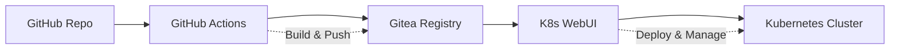

# Denshimon

🚀 Kubernetes and GitOps management platform with integrated monitoring, PASETO authentication, and single binary deployment.

## 🎯 Overview

A comprehensive web-based platform for managing Kubernetes clusters and GitOps workflows. Provides real-time cluster monitoring, automated deployments, and integrated observability with a single binary deployment model.

### Key Capabilities
- **Kubernetes Management**: Pods, deployments, nodes, scaling, logs with virtualized tables
- **GitOps Operations**: Full Gitea API integration, repository sync, CI/CD workflows  
- **Monitoring & Metrics**: Real-time metrics, historical trends, live log streaming
- **Performance Optimized**: Handles 50,000+ rows with smooth scrolling and filtering
- **Customizable Dashboard**: Hide/show UI sections, multiple view modes
- **Authentication**: PASETO v4 tokens, role-based access control, anti-SEO protection
- **Single Binary**: Embedded React SPA, SQLite database, zero external dependencies


<details>
  <summary>Click to expand: more Screenshots</summary>
  
  
  
  
  
  
  
  
  
</details>

## 🏗️ Architecture

### Tech Stack
- **Backend**: Go 1.24 + SQLite + PASETO auth
- **Frontend**: React 19 + TypeScript + Tailwind CSS + Vite
- **Deployment**: Single Docker image, Kubernetes-ready
- **Database**: SQLite (embedded, no external services)

### Project Structure
```
denshimon/
├── backend/           # Go REST API server
│   ├── cmd/server/    # Main application entry
│   ├── internal/      # Business logic
│   │   ├── api/       # HTTP handlers
│   │   ├── auth/      # Authentication service
│   │   ├── database/  # SQLite operations
│   │   ├── gitops/    # GitOps management
│   │   ├── k8s/       # Kubernetes client
│   │   └── metrics/   # Monitoring service
│   └── pkg/config/    # Configuration
├── frontend/          # React SPA
│   ├── src/
│   │   ├── components/ # UI components
│   │   ├── stores/     # State management
│   │   └── types/      # TypeScript definitions
│   └── dist/          # Build output (embedded in Go)
├── docker-compose.yml # Development setup
├── Dockerfile         # Production image
└── build.sh          # Local build script
```

## 🎨 UI Features

### Cyberpunk Design System
- **Colors**: Matrix green (#00FF00), yellow (#FFFF00), cyan (#00FFFF) on black
- **Typography**: Monospace fonts for terminal aesthetic  
- **Layout**: Responsive grid system with border outlines
- **Components**: Custom charts, tables, modals with cyberpunk styling

### Dashboard Views
- **Cluster Overview**: Real-time resource metrics and health status
- **Pod Management**: List, restart, delete, view logs with filtering
- **Deployment Control**: Scale replicas, view status, manage rollouts
- **GitOps Dashboard**: Repository sync status, application deployments
- **Resource Analytics**: CPU/memory/storage trends with interactive charts

## 🔧 Core Functionalities

### Kubernetes Management
```bash
# Pod Operations
GET    /api/k8s/pods              # List all pods (virtualized tables)
DELETE /api/k8s/pods/{name}       # Delete specific pod
POST   /api/k8s/pods/{name}/restart # Restart pod
GET    /api/k8s/pods/{name}/logs  # Stream logs

# Deployment Control  
GET   /api/k8s/deployments        # List deployments
PATCH /api/k8s/deployments/{name}/scale # Scale replicas

# Cluster Monitoring
GET /api/k8s/nodes                # List nodes with metrics
GET /api/k8s/health               # Cluster health check
GET /ws                           # WebSocket for real-time updates
```

### Gitea Integration (Optional)
```bash
# Repository Management
GET  /api/gitea/repositories      # List repositories
GET  /api/gitea/repositories/{owner}/{repo} # Get repository details
GET  /api/gitea/repositories/{owner}/{repo}/commits # List commits
GET  /api/gitea/repositories/{owner}/{repo}/branches # List branches
GET  /api/gitea/repositories/{owner}/{repo}/pulls # List pull requests
GET  /api/gitea/repositories/{owner}/{repo}/releases # List releases
GET  /api/gitea/repositories/{owner}/{repo}/actions/runs # List workflow runs

# Deployment Operations
POST /api/gitea/repositories/{owner}/{repo}/deploy # Trigger deployment
POST /api/gitea/webhook           # Webhook receiver (no auth)
```

### Metrics & Monitoring  
```bash
# Resource Metrics
GET /api/metrics/cluster          # Cluster-wide usage
GET /api/metrics/nodes            # Per-node metrics
GET /api/metrics/pods             # Pod resource usage
GET /api/metrics/history          # Historical trends

# Authentication
POST /api/auth/login              # Login with credentials
GET  /api/auth/me                 # Get current user
POST /api/auth/logout             # Logout
```

## 🚀 Use Cases

### 1. **GitOps CI/CD Pipeline**
Perfect for teams using GitHub Actions → Gitea Registry → Kubernetes:



**Workflow:**
1. Developer pushes code to GitHub
2. GitHub Actions builds Docker image
3. Image pushed to Gitea private registry
4. K8s WebUI detects changes, deploys to cluster
5. Monitor deployment status and metrics

### 2. **Multi-Environment Management**
Manage dev/staging/prod environments from single interface:

- **Environment Isolation**: Separate namespaces and configs
- **Progressive Deployment**: Deploy to dev → staging → prod
- **Resource Monitoring**: Track usage across environments
- **Access Control**: Role-based permissions per environment

### 3. **Kubernetes Cluster Administration**
Daily cluster operations and troubleshooting:

- **Resource Management**: Scale deployments based on metrics
- **Troubleshooting**: View logs, restart failed pods
- **Capacity Planning**: Monitor node resources and usage trends
- **Security**: Audit logs and access control

### 4. **Development Team Self-Service**
Empower developers with safe cluster access:

- **Deployment Control**: Deploy and rollback applications
- **Log Access**: Debug issues without kubectl access
- **Resource Monitoring**: Track application performance
- **Environment Management**: Manage feature branch deployments

### 5. **GitOps Repository Management**
Centralized management of infrastructure as code:

- **Repository Sync**: Auto-sync K8s manifests from Git
- **Application Lifecycle**: Deploy, update, delete applications
- **Configuration Management**: Manage ConfigMaps and Secrets
- **Compliance**: Track changes and maintain audit trail

## 🔐 Authentication & Authorization

### User Roles
- **Admin**: Full cluster access (create, read, update, delete)
- **Operator**: Deploy and manage applications (read, update, scale, sync)  
- **Viewer**: Read-only access to resources and metrics

### Default Credentials (Demo)
```bash
Username: admin     Password: password  # Full access
Username: operator  Password: password  # Limited admin  
Username: viewer    Password: password  # Read-only
```

### Security Features
- PASETO v4 token authentication
- SQLite-based session management  
- Role-based API endpoint protection
- Kubernetes RBAC integration
- Audit logging for all operations

## 🐳 Deployment

### Quick Start (Docker)
```bash
# Run with Docker
docker run -d \
  -p 8080:8080 \
  -v denshimon-data:/app/data \
  -v ~/.kube:/home/denshimon/.kube:ro \
  --name denshimon \
  denshimon:latest
```

### Production (Kubernetes)
```bash
# Deploy with persistent volume
kubectl apply -f k8s-deployment.yaml

# Access via port-forward  
kubectl port-forward svc/denshimon 8080:80
```

### Development Setup
```bash
# Clone repository
git clone https://github.com/archellir/denshimon.git
cd denshimon

# Install dependencies
cd backend && go mod tidy
cd ../frontend && pnpm install

# Development mode (2 terminals for hot reload)
# Terminal 1: Backend API
cd backend && DATABASE_PATH=./test-app.db go run cmd/server/main.go

# Terminal 2: Frontend with hot reload
cd frontend && pnpm run dev

# Access at http://localhost:5173
# Login: admin / password

# Production build (single binary)
cd frontend && pnpm run build && cp -r dist/* ../backend/cmd/server/spa/
cd ../backend && DATABASE_PATH=./test-app.db go run cmd/server/main.go
```

## 📊 Configuration

### Environment Variables
```bash
# Core Configuration
PORT=8080                           # Server port
DATABASE_PATH=/app/data/denshimon.db # SQLite database
PASETO_SECRET_KEY=your-32-byte-key  # Auth signing key
TOKEN_DURATION=24h                  # Token expiration
LOG_LEVEL=info                      # Logging level
ENVIRONMENT=production              # Runtime environment

# Gitea Integration (Optional)
GITEA_URL=https://gitea.example.com # Gitea server URL
GITEA_TOKEN=your-api-token          # Gitea API token
GITEA_WEBHOOK_SECRET=webhook-secret # Optional webhook verification
```

### Kubernetes Integration
```bash
# Mount kubeconfig for cluster access
-v ~/.kube:/home/denshimon/.kube:ro

# Or use in-cluster service account
# Automatically detected when running in K8s pod
```

## 🔍 Monitoring & Observability

### Built-in Metrics
- **Cluster Resources**: CPU, memory, storage utilization
- **Node Health**: Status, capacity, resource pressure  
- **Pod Metrics**: Resource usage, restart counts, status
- **Application Health**: Deployment status, replica counts
- **GitOps Sync**: Repository sync status, last sync times

### Integration Points  
- **Prometheus**: Metrics scraping endpoints
- **Grafana**: Custom dashboards for K8s WebUI metrics
- **Alerting**: Webhook integration for notifications
- **Audit Logs**: SQLite-based audit trail for compliance

## 🎯 Roadmap

### Phase 1: Core Platform ✅
- [x] React SPA with cyberpunk UI and proper routing
- [x] PASETO v4 authentication with role-based access
- [x] SQLite database with proper schema
- [x] Kubernetes mock data and interfaces  
- [x] GitOps service structure
- [x] Development mode with hot reload
- [x] Single binary deployment capability
- [x] Authentication flow with proper redirects
- [x] Protected routes and token validation
- [x] Dashboard with metrics tabs (overview, nodes, pods, etc.)
- [x] Comprehensive mock data for testing

### Phase 2: Performance & Integration ✅
- [x] Virtualized tables for 50,000+ rows with smooth scrolling
- [x] Live log streaming with search and filtering
- [x] Full Gitea API integration with secure backend architecture
- [x] Dashboard customization (hide/show sections and tabs)
- [x] Anti-SEO protection for internal services
- [x] WebSocket real-time updates for metrics
- [x] Card/table view toggles for different screen sizes
- [x] TypeScript strict mode with comprehensive typing

### Phase 3: Advanced Features 🚧
- [ ] Pod exec terminal (WebSocket)
- [ ] Real Kubernetes cluster integration
- [ ] Port forwarding through web interface
- [ ] Custom resource definitions (CRDs)
- [ ] Helm chart management
- [ ] Custom metrics dashboard builder

### Phase 4: Enterprise Features 📋
- [ ] Multi-cluster management
- [ ] LDAP/OAuth integration  
- [ ] Advanced RBAC policies
- [ ] Backup and restore
- [ ] High availability setup

## 📚 Documentation

- [Backend Documentation](./backend/README.md) - Go API server details
- [Frontend Documentation](./frontend/README.md) - React SPA development  
- [API Reference](./docs/api.md) - Complete endpoint documentation
- [Deployment Guide](./docs/deployment.md) - Production setup instructions

## 🤝 Contributing

1. Fork the repository
2. Create feature branch (`git checkout -b feature/amazing-feature`)
3. Commit changes (`git commit -m 'Add amazing feature'`)
4. Push to branch (`git push origin feature/amazing-feature`)
5. Open a Pull Request

## 📄 License

This project is licensed under the MIT License - see the [LICENSE](LICENSE) file for details.


---

**Made with ❤️ for the Kubernetes community**

*A modern, secure, and intuitive way to manage your Kubernetes infrastructure with GitOps workflows.*
